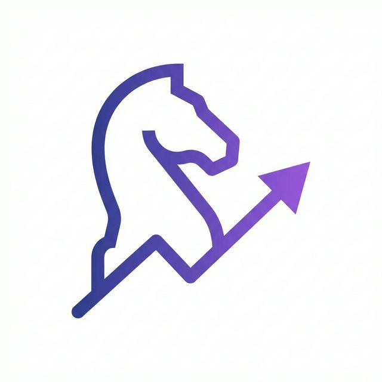

# Chesslyze

**Advanced chess analytics and personalized learning platform to improve your game.**

Chesslyze is a Progressive Web App that provides deep, move-by-move analysis of your chess games, helping you identify mistakes, discover brilliant moves, and track your improvement journey.



## ✨ Features

### 📊 Advanced Game Analysis
- **Stockfish 17.1 Engine Integration** - Industry-leading chess engine analysis
- **Move Classification** - Automatic tagging of blunders, mistakes, brilliant moves, and great moves
- **Position Evaluation** - Real-time evaluation scores for every position
- **Opening Recognition** - ECO code identification and opening theory

### 📚 Games Library
- **Import from Lichess** - Fetch your games directly from your Lichess profile
- **Local Storage** - All games stored offline using IndexedDB
- **Advanced Filtering** - Filter by result, color, time control, opening, opponent
- **Search** - Quick search across all your games
- **Analysis Status** - Track which games have been analyzed

### 🎯 Interactive Dashboard
- **Live Chessboard** - Interactive board for game review
- **Move Navigation** - Browse through games move-by-move
- **Analysis Panel** - View engine evaluations, best moves, and insights
- **Opening Explorer** - Explore opening theory and master games
- **Statistics** - Track your performance trends and statistics

### 📖 Opening Explorer
- **Master Games Database** - Study how grandmasters play your openings
- **Opening Books** - Learn common variations and best practices
- **Position Search** - Find games from specific positions

### 👤 Profile & Analytics
- **Chess Journey** - Visual timeline of your chess improvement
- **Performance Stats** - Win/loss ratios, rating trends, time control analysis
- **Game History** - Complete archive of all your games
- **Export & Share** - Share your stats and achievements

### ⚙️ Powerful Settings
- **Engine Configuration** - Customize Stockfish analysis depth and time
- **Data Management** - Import/export your entire game database
- **Theme Customization** - Dark mode optimized interface
- **Performance Tuning** - Adjust analysis queue and processing

### 📱 Progressive Web App
- **Install on Mobile** - Add to home screen like a native app (iOS & Android)
- **Offline Support** - Access your games and analysis without internet
- **Fast & Responsive** - Optimized for performance on all devices
- **Auto-Updates** - Get the latest features automatically

## 🚀 Getting Started

### Prerequisites
- Node.js 18+ and npm

### Installation

1. **Clone the repository**
   ```bash
   git clone <repository-url>
   cd Chesslyze
   ```

2. **Install dependencies**
   ```bash
   npm install
   ```

3. **Start development server**
   ```bash
   npm run dev
   ```
   The app will be available at `http://localhost:5173`

4. **Build for production**
   ```bash
   npm run build
   ```
   Production files will be in the `dist/` directory

5. **Preview production build**
   ```bash
   npm run preview
   ```

## 🌐 Deployment

### Deploy to Vercel

The project is configured for root deployment on Vercel:

1. **Build command:** `npm run build`
2. **Output directory:** `dist`
3. **Install command:** `npm install`

The Vite `base` is `/`, so generated assets load from the Vercel domain root.

See [DEPLOY.md](./DEPLOY.md) for detailed instructions.

## 🛠️ Tech Stack

### Core
- **React 19** - UI framework
- **Vite 7** - Build tool and dev server
- **React Router 7** - Client-side routing

### Chess Engine
- **Stockfish 17.1** - Chess engine via WebAssembly
- **chess.js** - Chess logic and move validation
- **react-chessboard** - Interactive chessboard component

### Data & Storage
- **Dexie.js** - IndexedDB wrapper for local storage
- **Zod** - Schema validation

### Analytics & Visualization
- **Recharts** - Charts and data visualization
- **Lucide React** - Icon library

### PWA
- **vite-plugin-pwa** - Progressive Web App support
- **Workbox** - Service worker and caching strategies

## 📁 Project Structure

```
Chesslyze/
├── public/               # Static assets
│   ├── icon.png         # App icon (PWA)
│   ├── manifest.json    # PWA manifest
│   └── stockfish-*      # Stockfish engine files
├── src/
│   ├── components/      # React components
│   │   ├── Dashboard/   # Main game analysis dashboard
│   │   ├── Import/      # Game import functionality
│   │   ├── Library/     # Games library and filtering
│   │   ├── Opening/     # Opening explorer
│   │   ├── Profile/     # User profile and stats
│   │   ├── Reel/        # Game reels/highlights
│   │   ├── Settings/    # App settings
│   │   └── Layout.jsx   # Main layout wrapper
│   ├── services/        # Business logic
│   │   ├── analyzer.js  # Chess game analysis engine
│   │   ├── db.js        # IndexedDB database schema
│   │   └── *.js         # Other services
│   ├── hooks/           # Custom React hooks
│   ├── App.jsx          # Root component
│   ├── main.jsx         # App entry point + PWA registration
│   └── index.css        # Global styles
├── LICENSE              # Restrictive license
├── package.json         # Dependencies and scripts
└── vite.config.js       # Vite + PWA configuration
```

## 🎮 Usage

### Import Your Games
1. Navigate to **Import** section
2. Enter your Chess.com username
3. Click "Import Games" to fetch your game history
4. Games will be stored locally for offline access

### Analyze Games
1. Go to **Library** to browse imported games
2. Click on any game to open in Dashboard
3. The Stockfish engine will automatically analyze moves
4. Review evaluations, mistakes, and brilliant moves

### Explore Openings
1. Visit **Opening Explorer**
2. Play moves on the board to explore variations
3. View master games from the position
4. Learn opening theory and best practices

### Track Progress
1. Navigate to **Profile**
2. View your Chess Journey timeline
3. Analyze performance statistics
4. Export or share your progress

## 📲 Installing as PWA

### On Mobile (iOS)
1. Open Chesslyze in Safari
2. Tap the Share button
3. Select "Add to Home Screen"
4. Tap "Add" to install

### On Mobile (Android)
1. Open Chesslyze in Chrome
2. Tap the menu (⋮)
3. Select "Install app" or "Add to Home Screen"
4. Tap "Install"

### On Desktop
1. Open Chesslyze in Chrome/Edge
2. Look for install icon in address bar
3. Click to install
4. App opens in standalone window

## 🔒 License

This project is licensed under a restrictive license - see the [LICENSE](./LICENSE) file for details.

**TL;DR:** Free for personal use only. No redistribution or commercial use permitted.

## 🤝 Contributing

This is a personal project with a restrictive license. Feel free to fork for personal use, but please respect the license terms regarding redistribution and commercial use.

## 📝 Future Roadmap

- [ ] Custom opening repertoire builder
- [ ] Spaced repetition for tactics training
- [ ] Multiplayer analysis rooms
- [ ] Integration with other chess platforms (Chess.com, etc.)
- [ ] Advanced statistics and ML-based insights

## 💡 Credits

- Chess engine powered by [Stockfish](https://stockfishchess.org/)
- Chess logic by [chess.js](https://github.com/jhlywa/chess.js)
- UI components from [Lucide](https://lucide.dev/)

---

**Chesslyze** - Your journey continues with every move.
